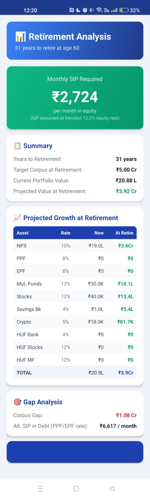

# 🎯 Retirement Planner — Android App

A financial planning app to calculate the monthly SIP contribution needed to reach your retirement corpus target.


## Screenshots





---

## 📱 Features

- **8 Asset Inputs**: NPS, PPF, EPF, MF, Stocks, HUF Bank, HUF Stocks, HUF MF
- **Inflation-adjusted target**: Accounts for 6% inflation over your remaining years
- **Projected growth** per asset class at realistic rates
- **Gap analysis**: Shows exactly how much monthly SIP you still need
- **Configurable retirement age** (default: 60)
- **Indian currency formatting** (Lakhs / Crores)

---

## 📊 Rate Assumptions

| Asset Class        | Growth Rate |
|--------------------|-------------|
| NPS                | 10% p.a.    |
| PPF / EPF          | 8% p.a.     |
| Mutual Funds       | 12% p.a.    |
| Stocks             | 12% p.a.    |
| HUF Stocks/MF      | 12% p.a.    |
| HUF Bank           | 4% p.a.     |
| Inflation          | 6% p.a.     |

---

## 🔨 How to Build the APK

### Prerequisites
- [Android Studio](https://developer.android.com/studio) (free, ~1GB download)
- ~10 minutes of setup time

### Steps

1. **Download and install Android Studio** from https://developer.android.com/studio

2. **Open this project**:
   - Launch Android Studio
   - Click `File → Open`
   - Select the `RetirementPlanner` folder (this folder)
   - Click OK

3. **Wait for Gradle sync** (~2-3 minutes on first run — it downloads dependencies automatically)

4. **Build the APK**:
   - Click `Build → Build Bundle(s) / APK(s) → Build APK(s)`
   - Wait ~1-2 minutes

5. **Find your APK**:
   - A notification appears: "APK(s) generated successfully"
   - Click `locate` in the notification
   - APK is at: `app/build/outputs/apk/debug/app-debug.apk`

6. **Install on your phone**:
   - Transfer the APK to your Android phone (USB, WhatsApp, email, Google Drive)
   - On your phone: `Settings → Security → Allow unknown sources` (or "Install unknown apps")
   - Tap the APK file to install

---

## 📐 Financial Logic

### Step 1: Project Current Portfolio
Each asset grows using compound interest:
```
Future Value = Present Value × (1 + rate)^years
```

### Step 2: Inflation-Adjust the Target
```
Adjusted Target = Target × (1 + 0.06)^years
```

### Step 3: Calculate Gap
```
Gap = Adjusted Target − Total Projected Portfolio
```

### Step 4: Calculate Monthly SIP (FV of Annuity)
```
Monthly SIP = Gap × (r/12) / [(1 + r/12)^months − 1]
```
Where r = 12% (equity growth rate)

---

## 🗂 Project Structure

```
RetirementPlanner/
├── app/
│   ├── src/main/
│   │   ├── java/com/retirement/planner/
│   │   │   ├── MainActivity.java       ← Input screen
│   │   │   └── ResultActivity.java     ← Results & calculations
│   │   ├── res/
│   │   │   ├── layout/
│   │   │   │   ├── activity_main.xml   ← Input UI
│   │   │   │   └── activity_result.xml ← Results UI
│   │   │   ├── drawable/               ← Backgrounds & styles
│   │   │   └── values/                 ← Colors, strings, themes
│   │   └── AndroidManifest.xml
│   └── build.gradle
├── build.gradle
├── settings.gradle
└── README.md
```

---

## 🆘 Troubleshooting

**"Gradle sync failed"** → Check your internet connection; Gradle needs to download dependencies (~50MB)

**"SDK not found"** → In Android Studio: `Tools → SDK Manager` → Install Android SDK 34

**"Cannot install APK"** → Enable "Unknown sources" in phone Settings → Security

---

Built with ❤️ for Indian retirement planning
"# RetirementPlanner" 
